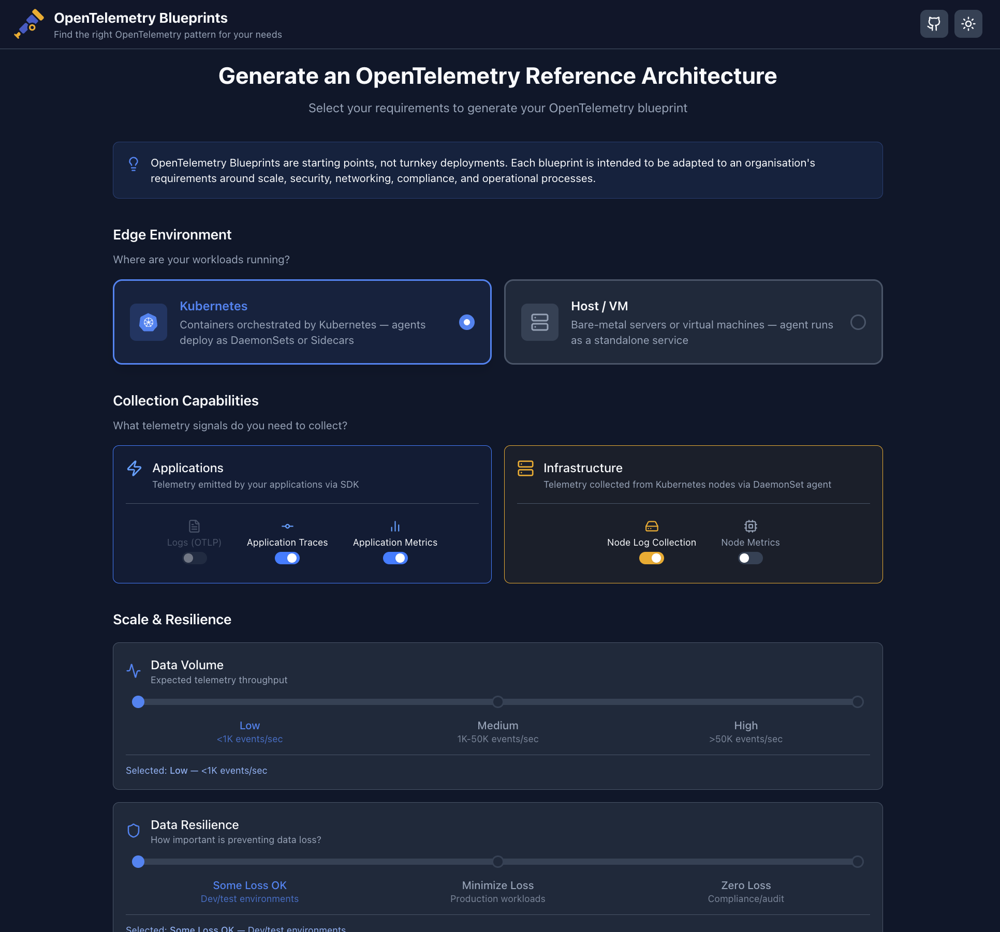
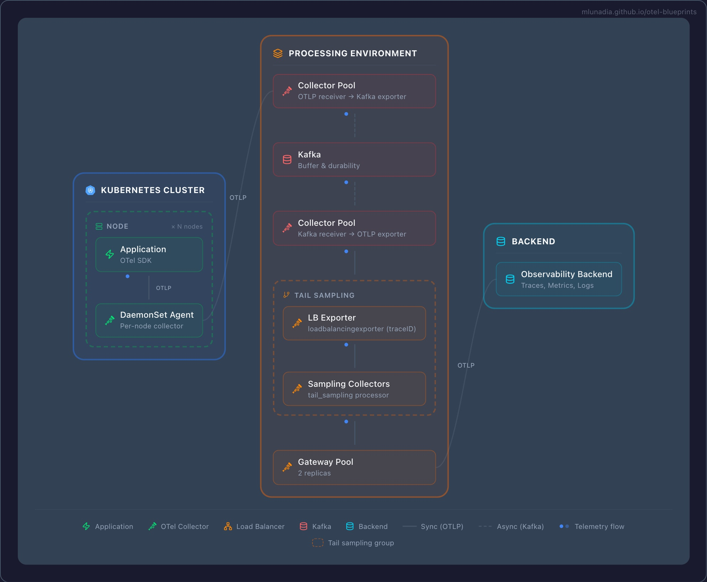
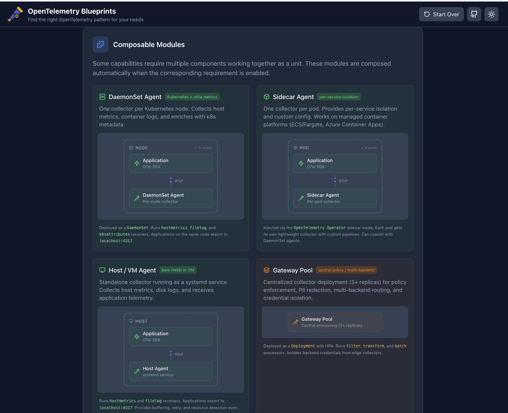

# OpenTelemetry Blueprints

An interactive tool that generates OpenTelemetry Collector reference architectures from your requirements. Select your environment, scale, collection needs, and resilience policy — get a composed blueprint diagram with reference configurations you can open directly in [OTelBin](https://www.otelbin.io).

**[Try it live](https://mlunadia.github.io/otel-blueprints/)**

> OpenTelemetry Blueprints are starting points, not turnkey deployments. Each blueprint is intended to be adapted to your organisation's requirements around scale, security, networking, compliance, and operational processes.

## How It Works

### 1. Define your requirements

Toggle the capabilities you need — application traces, metrics, disk log collection, host metrics — and set your environment (Kubernetes or Host/VM), data volume, and resilience policy.



### 2. Get your blueprint

Click **Build My Architecture** and get a composed architecture diagram with animated data flow, complexity scoring, and actionable recommendations. Download the diagram as an image or open the reference configs in OTelBin for validation.



### 3. Explore the building blocks

Browse the composable modules that make up every blueprint — edge collectors, gateway pools, tail sampling tiers, persistent queues, and Kafka buffering — each with detailed reference configurations.



## What You Can Configure

| Category | Options |
|----------|---------|
| **Environment** | Kubernetes, Host / VM |
| **Application signals** | Logs (OTLP), Traces, Metrics |
| **Infrastructure signals** | Disk Log Collection (filelog), Host Metrics |
| **Data volume** | Low, Medium, High |
| **Resilience** | Loss OK, Minimize Loss (WAL), Zero Loss (Kafka) |
| **Processing** | Central policy, Multi-backend routing, Tail sampling |
| **Constraints** | Managed containers (ECS/Fargate), Per-service isolation (sidecars) |

## Architecture Layers

Every blueprint is composed from three layers:

- **Edge** — how telemetry enters the pipeline: DaemonSet Agent, Sidecar Agent, Host Agent, or Direct SDK
- **Processing** — central processing when needed: Gateway Pool, Tail Sampling Tier with two-step pipeline (spanmetrics before sampling via forward connector)
- **Resilience** — data durability: In-Memory Queues, Persistent Queues (WAL), or Kafka Buffer

## Key Features

- **Real-time composition** — architecture updates instantly as you toggle requirements
- **Visual pipeline diagrams** — animated data flow with interactive component tooltips
- **Reference configurations** — collector YAML configs with one-click [OTelBin](https://www.otelbin.io) integration for visualization and validation
- **Smart defaults** — disk log collection enabled by default (the recommended production pattern for application logs via stdout → filelog receiver)
- **Image export** — download your blueprint as a JPG with a descriptive filename
- **Feedback loop** — submit feedback or report configuration issues directly as GitHub issues

## Running Locally

```bash
npm install
npm run dev
```

## License

This project is provided as-is for educational and reference purposes.
